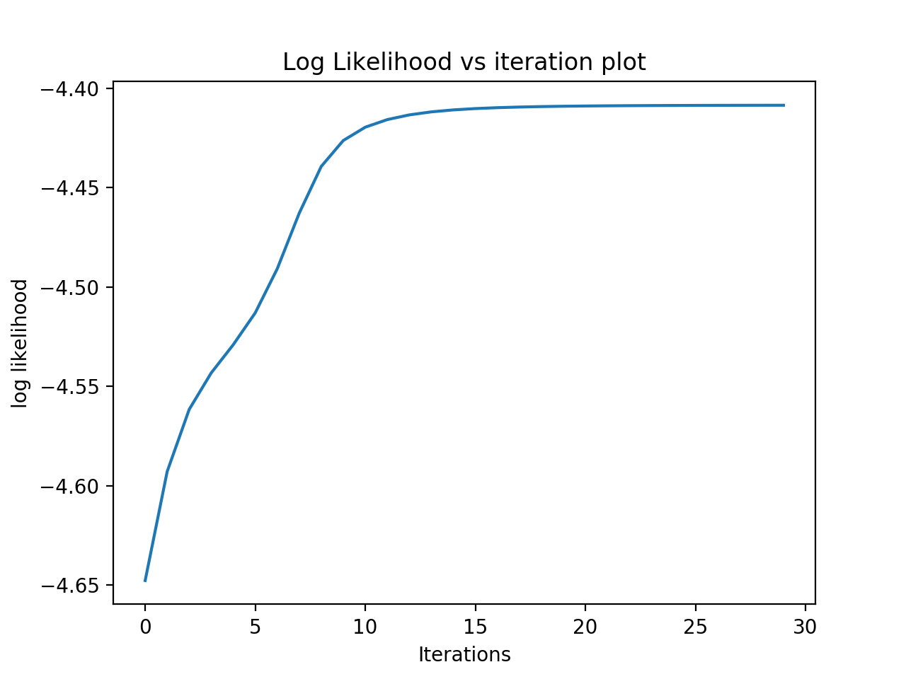

# EM-Gaussian

## Main codes:
```python

while current_iter < args.iterations:
        """ E step """
        for k in range(args.cluster_num):
            if not args.tied:
                P_Z_given_X[:, k] = lambdas[k] * N_X_given_muk_sigmak(train_xs, mus[k], sigmas[k])
            else:
                P_Z_given_X[:, k] = lambdas[k] * N_X_given_muk_sigmak(train_xs, mus[k], sigmas)

        ## Normalize to make the matrix row stochastic
        P_Z_given_X = (P_Z_given_X.T / np.sum(P_Z_given_X, axis = 1)).T
        ## The number of datapoints belonging to each cluster           
        Num_ks = np.sum(P_Z_given_X, axis = 0)

        """ M step: calculate the new mus and sigmas for each gaussian by applying above P_Z_given_X """
        for k in range(args.cluster_num):
            # lambdas update
            lambdas[k] = 1.0 / N * Num_ks[k]

            # mus update
            total = np.matrix([0.0, 0.0])
            for i in range(N):
                # print("********P_Z_given_X[k][i]: ", P_Z_given_X[k][i])
                temp2 = P_Z_given_X[i][k] * train_xs[i]

                total += temp2
            mus[k] = total / Num_ks[k]
            x_minus_mus = np.matrix(train_xs - mus[k])

            # sigmas updata
            if not args.tied:
                sigmas[k] = np.array(1.0 / Num_ks[k] * np.dot(np.multiply(x_minus_mus.T, P_Z_given_X[:, k]), x_minus_mus))
            else:
                sigmas = np.array(1.0 / Num_ks[k] * np.dot(np.multiply(x_minus_mus.T, P_Z_given_X[:, k]), x_minus_mus))

        ## likelihood computation for plotting
        current_model = [lambdas, mus, sigmas]
        # current_log_likelihood = np.sum(np.log(np.sum(P_Z_given_X, axis = 1)))
        current_log_likelihood = average_log_likelihood(current_model, train_xs, args)
        log_likelihoods.append(current_log_likelihood)

        current_iter += 1
        if not args.nodev:
            ll_dev = average_log_likelihood(current_model, dev_xs, args)
            print("iter %s dev log_likelihood: %s" % (str(current_iter), str(ll_dev)))
            if ll_dev > best_ll:
                best_ll = ll_dev
                best_model = current_model
                best_iter = current_iter
        print("iter %s train log_likelihood: %s" % (str(current_iter), str(current_log_likelihood)))


```


## 1.What I did?

	  1.1 Implemented the model initilization
	  1.2 Implemented both tied and full covariance
	  1.3 Implemented the logic of E and M step
	  1.4 Declared and implemented a function for computing Prob given the whole data matrix
	  1.5 Implemented logic using dev data to choose best model
	  1.6 Run different set of hyperparameters to choose best K(number of clusters) and I(number of iterations) for the data given
	  1.7 Wrote a function to plot the trend of average likelihood based on different input
	  1.8 Wrote a function to visualize the cluster

## 2.Implemented the model initilization

	  For lambdas: equal weights
	  For mus: randomly choose K data as the mus
	  For sigmas: just compute all the data's initial cov

  The initialization is also important. Normally we choose the mus that not that close to each other.

  I tried several times of same args. Every time the initialization are different because of random. However, the results were very similar finally. So we can see that the GMM is a good model with convergence.

## 3.Tied and full covariance



Tied: (2,2) all used the same tied covariance
Full: (args.cluster_num,2,2) k different covariance

I tried tied and full on the data and get quiet different results. Full cov are much better than the tied that the tied's corresponding ll even decrease with the iteration increases. Because there are two different gaussian model for each cluster. They don't need to be with total same cov. So the full cov will better help to train the data.

	[Tied:]
		best iterations: 26
		Train LL: -4.6434310115250135
		Dev LL: -4.573054852627335
		Lambdas: 0.3309869716225309 | 0.3112811767125003 | 0.35773185166496907
		Mus: -1.5656443 0.78612924 | 1.0287335 -3.423897 | -1.7639995 0.59269464
		Sigma: 6.363095694082074 2.682985481094522 2.682985481094522 2.7155946906120434
	[Full]
		best iterations: 30
		Train LL: -4.408534943992172
		Dev LL: -4.428588478374703
		Lambdas: 0.21766690525109716 | 0.31900113086047127 | 0.46333196388843173
		Mus: -4.0276423 -0.014956189 | -0.027472558 1.9194889 | 0.121785015 -2.5956209
		Sigmas: 5.46446693090698 2.331650071097567 2.331650071097567 1.1739788583262072 | 1.0348618495556612 			0.27430423408046867 0.27430423408046867 1.0982431865261826 | 7.332494377897124 -0.2298343619722579 -0.22983436197225796 3.815331550650095


## 4.Declared and implemented a Prob computing function

  	Here all my computation are based on matrix. So I wrothe another function for computing Prob given the whole data matrix. It is also based on scipy.stats.multivariate_normal.

## 5.Logic for dev data

	5.1 Inside the train_model function, I only focus on the best iteration. I kept track of each iteration and compare the average likelihood finally return the best one.

	5.2 What's more, I also iterate K (number of clusters) and find the best hyperparameters set using different data. Here I run 30 iteration for each K and record the best ll on dev and final ll on training data. Every K run by 10 times to choose the best to avoid the influences of initialization. 
		Average log likelihood when K = 2: Train LL: -4.552393488272517		Dev LL: -4.652551176276237
		Average log likelihood when K = 3: Train LL: -4.4555812491750695	Dev LL: -4.559940625476985
		Average log likelihood when K = 4: Train LL: -4.356124260302845		Dev LL: -4.333912957848705
		Average log likelihood when K = 5: Train LL: -4.3572362793207615	Dev LL: -4.319924483847427
		Average log likelihood when K = 6: Train LL: -4.351551860156118		Dev LL: -4.3399043555224095
		Average log likelihood when K = 7: Train LL: -4.3502621987954315	Dev LL: -4.334131138057317
		Average log likelihood when K = 10: Train LL: -4.348944327376958	Dev LL: -4.326733513037062

	From the log likelihood running on dev data, the best K is 5 and the I is 25.


## 6.Likelihood changing with iterations

I run 30 iterations based on gaussian_smoketest_clusters.txt and get the result as follows. I also plotted them out in the graph. We can see that only after 13 iterations, the log likelihood changes very little after that. Because after rough 13 iterations, the data already converged.

	Train LL: -4.552389712650888
	Dev LL: -4.651680060110019 (iterations: 13)
	Lambdas: 0.3687387825619876 | 0.6312612174380123
	Mus: -0.22733368924786956 1.8138575955444145 | -1.1804852023826538 -1.999821958553207
	Sigmas: 1.4037872999856293 0.5055214037437291 0.5055214037437291 1.0645775809832363 | 11.150122405331867 -1.8791714445924614 -1.8791714445924614 4.024144819215513

	iter 1 dev log_likelihood: -4.822407754891544
	iter 1 train log_likelihood: -4.795391728245874
	iter 2 dev log_likelihood: -4.791350788360846
	iter 2 train log_likelihood: -4.762766949823095
	iter 3 dev log_likelihood: -4.771975507178417
	iter 3 train log_likelihood: -4.740737480554617
	iter 4 dev log_likelihood: -4.756540523994907
	iter 4 train log_likelihood: -4.720579110423338
	iter 5 dev log_likelihood: -4.745295422963848
	iter 5 train log_likelihood: -4.701901681973038
	iter 6 dev log_likelihood: -4.738633163842792
	iter 6 train log_likelihood: -4.68478393104509
	iter 7 dev log_likelihood: -4.733758549496411
	iter 7 train log_likelihood: -4.667227130659346
	iter 8 dev log_likelihood: -4.724011585604916
	iter 8 train log_likelihood: -4.645511513798269
	iter 9 dev log_likelihood: -4.703690367668828
	iter 9 train log_likelihood: -4.617820499129099
	iter 10 dev log_likelihood: -4.678640593759873
	iter 10 train log_likelihood: -4.588617507202847
	iter 11 dev log_likelihood: -4.660384618227316
	iter 11 train log_likelihood: -4.566437683244976
	iter 12 dev log_likelihood: -4.6529402562581
	iter 12 train log_likelihood: -4.5559531940571265
	iter 13 dev log_likelihood: -4.651596224688492
	iter 13 train log_likelihood: -4.553060868246512
	iter 14 dev log_likelihood: -4.651601584564344
	iter 14 train log_likelihood: -4.552503917555793
	iter 15 dev log_likelihood: -4.651679512219045
	iter 15 train log_likelihood: -4.552409594600409
	iter 16 dev log_likelihood: -4.651711254434139
	iter 16 train log_likelihood: -4.5523935266410644
	iter 17 dev log_likelihood: -4.6517180742149336
	iter 17 train log_likelihood: -4.552390555662009
	iter 18 dev log_likelihood: -4.65171585106752
	iter 18 train log_likelihood: -4.552389929761206
	iter 19 dev log_likelihood: -4.651711085496578
	iter 19 train log_likelihood: -4.552389777183576
	iter 20 dev log_likelihood: -4.651706055267584
	iter 20 train log_likelihood: -4.552389734806648
	iter 21 dev log_likelihood: -4.6517014562880785
	iter 21 train log_likelihood: -4.552389721644571
	iter 22 dev log_likelihood: -4.651697437514994
	iter 22 train log_likelihood: -4.5523897170426
	iter 23 dev log_likelihood: -4.651693974903871
	iter 23 train log_likelihood: -4.552389715164737
	iter 24 dev log_likelihood: -4.651691000741476
	iter 24 train log_likelihood: -4.552389714239704
	iter 25 dev log_likelihood: -4.651688444132804
	iter 25 train log_likelihood: -4.552389713696417
	iter 26 dev log_likelihood: -4.651686242847816
	iter 26 train log_likelihood: -4.552389713336074
	iter 27 dev log_likelihood: -4.651684344150161
	iter 27 train log_likelihood: -4.552389713080554
	iter 28 dev log_likelihood: -4.651682704269082
	iter 28 train log_likelihood: -4.552389712893506
	iter 29 dev log_likelihood: -4.651681286750287
	iter 29 train log_likelihood: -4.552389712754631
	iter 30 dev log_likelihood: -4.651680060110019
	iter 30 train log_likelihood: -4.552389712650888


